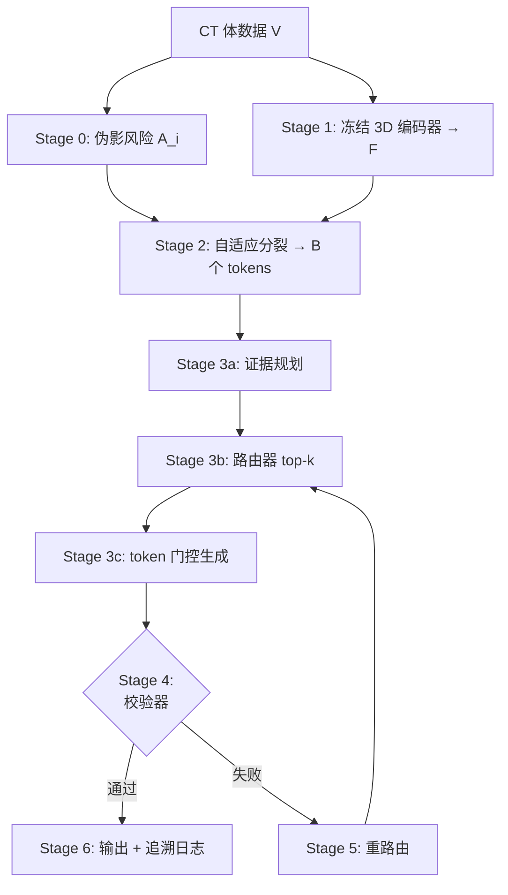

# ProveTok v3.0：完整数学工作流
**方法 M1--M5 全推导、核验与流水线总结**

## 目录
- [执行摘要](#执行摘要)
- [统一符号表](#统一符号表)
- [流水线总览](#流水线总览)
-[M1：预算约束的 3D 证据 Token Bank（Stage 0--2）](#m1预算约束的-3d-证据-token-bankstage-0--2)
- [M2：轻量跨模态路由器](#m2轻量跨模态路由器)
- [M3：逐句 Token 门控生成](#m3逐句-token-门控生成)
-[M4：规则校验器与一次性重路由（Stage 4--5）](#m4规则校验器与一次性重路由stage-4--5)
-[M5：匹配计算量评估与统计协议](#m5匹配计算量评估与统计协议)
-[超参数总结](#超参数总结)
- [未决问题清单](#未决问题清单)
-[方法--相关工作交叉引用](#方法--相关工作交叉引用)

---

## 执行摘要

ProveTok v3.0 是一个六阶段流水线，用于生成带句级证据追溯的可验证 3D CT 放射报告。该流水线将 CT 体数据转化为预算约束的*证据 token bank*，通过轻量跨模态路由器将 token 子集路由到每句报告，在 token 门控接口下生成句子（构造性地保证引用正确性），应用规则校验器，并在统计稳健的评估协议下报告结果。

本文档提供每个阶段（方法 M1--M5）的**完整数学规范**，包括逐步推导、边界情形分析、单调性/有界性证明，以及统一的符号参考。

---

## 统一符号表

| **符号** | **描述** |
| :--- | :--- |
| $V \in \mathbb{R}^{D \times H \times W}$ | 输入 CT 体数据 |
| $F = \{f_i\}_{i=1}^{N}$ | 冻结 3D 编码器输出的特征图；$f_i \in \mathbb{R}^d$ |
| $A_i \in [0,1]$ | 第 $i$ 个空间单元的伪影风险分数 |
| $g_i \in (0,1)$ | 由 $A_i$ 导出的 sigmoid 软门控 |
| $H_i$ | 第 $i$ 个单元的不确定性（熵） |
| $P_i$ | 第 $i$ 个单元的语义先验分数 |
| $q(\cdot) \in [0,1]$ | 分位数归一化（按深度层、按病例） |
| $S_i \in[0,1)$ | 第 $i$ 个单元的综合重要性分数 |
| $B$ | token 预算（默认 64） |
| $k$ | 每句 top-$k$ 证据 token（默认 8） |
| $W_{\mathrm{proj}} \in \mathbb{R}^{d_t \times d}$ | 可学习线性投影矩阵（路由器） |
| $v_i \in \mathbb{R}^{d_t}$ | 投影并归一化后的视觉 token 嵌入 |
| $q_s \in \mathbb{R}^{d_t}$ | 句子主题 $s$ 的文本查询嵌入 |
| $r_i^{(s)}$ | token $i$ 对句子 $s$ 的余弦路由分数 |
| $\hat{r}_i^{(s)}$ | 加入空间先验后的路由分数 |
| $\tau$ | InfoNCE 温度参数（默认 0.07） |
| $\mathcal{P}_s, \mathcal{N}_s$ | 句子 $s$ 的正样本 / 负样本 token 集合 |
| $\mathrm{sev}_i$ | 规则违反的严重度权重 |
| $\gamma$ | 对数平滑惩罚缩放因子（默认 2.0） |
| $\epsilon$ | 解剖优先模式中语义 tiebreak 权重（默认 0.05） |
| $\theta_{\mathrm{ratio}}$ | R1 侧别同侧 ratio 阈值（默认 0.6） |
| $\theta_{\mathrm{support}}$ | R2 解剖支持率阈值（默认 0.8） |

---

## 流水线总览

*图 1: ProveTok v3.0 六阶段流水线。Stage 0--2 = **M1**（token bank），Stage 3b = **M2**（路由器），Stage 3c = **M3**（门控生成），Stage 4--5 = **M4**（校验+重路由），评估协议 = **M5**。*

---

## M1：预算约束的 3D 证据 Token Bank（Stage 0--2）

### Stage 0：伪影风险评分

**定义 1（伪影风险分数）**
对每个空间单元 $i$：
$$
A_i = \operatorname{clip}\Bigg(
    w_{\mathrm{snr}} \cdot \operatorname{norm}\!\!\left(\frac{\sigma_i}{|\mu_i|+\epsilon}\right)
    + w_{\mathrm{st}} \cdot \operatorname{norm}(\mathrm{streak}_i)
    + w_{\mathrm{out}} \cdot \operatorname{norm}(\mathrm{outlier}_i),\;0,\;1
\Bigg)
$$
其中 $\mu_i, \sigma_i$ 为局部均值与标准差，$\mathrm{streak}_i$ 捕捉条纹状结构噪声，$\mathrm{outlier}_i$ 衡量体素级异常程度，$\operatorname{norm}(\cdot)$ 将各指标映射到 $[0,1]$。权重满足 $w_{\mathrm{snr}} + w_{\mathrm{st}} + w_{\mathrm{out}} = 1$，默认 $(0.5, 0.3, 0.2)$。

**设计动机。** 逆信噪比项 $\sigma_i/(|\mu_i|+\epsilon)$ 在噪声主导时增大。条纹伪影（金属/射束硬化）与统计离群值提供互补检测通道。裁剪到 $[0,1]$ 保证 $A_i$ 为有效的风险概率。

**备注（$\operatorname{norm}(\cdot)$ 实现）。** 代码中 $\operatorname{norm}(\cdot)$ 采用 min-max 归一化：对同一批次的原始值 $\{x_i\}$，$\operatorname{norm}(x_i) = (x_i - x_{\min}) / (x_{\max} - x_{\min})$。当 $x_{\max} = x_{\min}$ 时回退到常数 $0.5$。

### Sigmoid 软门控

**定义 2（软门控）**
$$
g_i = \sigma\!\big(-k_{\mathrm{gate}}(A_i - \tau_A)\big)
    = \frac{1}{1 + \exp\!\big(k_{\mathrm{gate}}(A_i - \tau_A)\big)}
$$
其中 $k_{\mathrm{gate}} > 0$ 控制陡峭度（默认 15），$\tau_A \in (0,1)$ 为伪影阈值（默认 0.85）。

**命题 1（门控性质）**
1. **值域：** 对所有 $A_i \in[0,1]$，$g_i \in (0,1)$。
2. **单调性：** $g_i$ 关于 $A_i$ 严格递减。
3. **阈值行为：** $g_i(\tau_A) = 0.5$；$A_i \gg \tau_A \Rightarrow g_i \to 0$；$A_i \ll \tau_A \Rightarrow g_i \to 1$。

**证明：**
(1) 由于 $\sigma(x) \in (0,1)$ 对所有 $x \in \mathbb{R}$ 成立，值域立即得证。
(2) 对 $A_i$ 求导：
$$
\frac{\partial g_i}{\partial A_i}
= \underbrace{\sigma(-k_{\mathrm{gate}}(A_i-\tau_A))}_{>0}\;
  \underbrace{(1 - \sigma(-k_{\mathrm{gate}}(A_i-\tau_A)))}_{>0}
  \cdot \underbrace{(-k_{\mathrm{gate}})}_{<0} < 0
$$
因此 $g_i$ 关于 $A_i$ 严格递减。
(3) 当 $A_i=\tau_A$ 时：$g_i=\sigma(0)=0.5$。取默认值 $k_{\mathrm{gate}}=15,\,\tau_A=0.85$：
$$ A_i=1 \Rightarrow g_i \approx \sigma(-2.25) \approx 0.095, \quad A_i=0 \Rightarrow g_i \approx \sigma(12.75) \approx 1.0 $$
■

### Stage 1：冻结 3D 编码器

预训练的 3D 编码器（SwinUNETR，$\mathrm{feature\_size}=48$，$\mathrm{spatial\_dims}=3$）处理体数据 $V$，输出特征图 $F = \{f_i \in \mathbb{R}^d\}_{i=1}^{N}$。输入体积统一 resize 到 $128^3$。编码器权重**全程冻结**，无梯度回传。

### Stage 2：综合评分

**定义 3（分位数归一化）**
对同一八叉树深度层、同一病例内的原始值 $\{x_i\}$：
$$
q(x_i) = \frac{\mathrm{rank}(x_i)}{n}, \quad n = |\{x_j : \text{同一深度层}\}|
$$
在每轮处理中冻结（迭代分裂时不重算）。对离群值鲁棒，输出近似均匀分布。

**定义 4（综合重要性分数）**
$$
S_i = g_i \cdot \big(\lambda_h \, q(H_i) + \lambda_p \, q(P_i)\big), \quad \lambda_h + \lambda_p = 1
$$
默认：$\lambda_h = 0.6$，$\lambda_p = 0.4$。

**命题 2（分数有界性）**
对所有合法输入，$S_i \in[0, 1)$。

**证明：**
由 $q(\cdot) \in [0,1]$ 及 $\lambda_h + \lambda_p = 1$：$0 \le \lambda_h q(H_i) + \lambda_p q(P_i) \le 1$。
由 $g_i \in (0,1)$（命题 1）：
$$
0 \le S_i = g_i \cdot (\lambda_h q(H_i) + \lambda_p q(P_i)) < 1
$$
下界在 $q(H_i)=q(P_i)=0$ 时取到。上界严格小于 1，因为 $g_i < 1$。
■

### 自适应八叉树分裂算法

1. **初始化：** 以整个体数据为单个根单元。
2. **选择候选：** 在当前叶子中选 $i^* = \arg\max_i S_i$（需超过分裂阈值）。
3. **分裂：** 将 $i^*$ 细分为 8 个子单元；对每个子 $j$ 计算 $f_j, A_j, g_j, H_j, P_j, S_j$。
4. **预算检查：** 若叶子数 $\ge B$，执行 batched top-$B$ + 空间 NMS 裁剪到恰好 $B$ 个 token。
5. **终止：** 无候选超过阈值，或预算耗尽。

该过程类似于 OctNet 的不平衡八叉树（叶节点存 pooled feature），但以 $S_i$（而非 occupancy）作为分裂准则，将空间分辨率集中在高重要性区域。

### 边界感知导出

**定义 5（边界上下文混合）**
对有邻居 $\mathcal{N}(i)$ 的导出 token $i$：
$$
\begin{aligned}
b_i &= \frac{1}{|\mathcal{N}(i)|} \sum_{j \in \mathcal{N}(i)} f_j, \\
f_i^{\mathrm{export}} &= (1 - \beta)\, f_i + \beta\, b_i, \quad \beta \in [0,1]
\end{aligned}
$$
默认 $\beta = 0.1$。边界框额外扩展 12.5%。

**命题 3（凸组合稳定性）**
$$
\|f_i^{\mathrm{export}}\| \le (1-\beta)\|f_i\| + \beta\|b_i\|
\le (1-\beta)\|f_i\| + \frac{\beta}{|\mathcal{N}(i)|}\sum_{j \in \mathcal{N}(i)} \|f_j\|
$$
若所有特征范数以 $M$ 为界，则 $\|f_i^{\mathrm{export}}\| \le M$。不会数值爆炸。

**备注（邻域为空的回退）。** 当 $|\mathcal{N}(i)|=0$（孤立叶节点）：令 $b_i = f_i$（等价 $\beta=0$），得 $f_i^{\mathrm{export}}=f_i$。

**备注（归一化交互）。** 若 $f_i$ 经 $L_2$ 归一化，线性均值 $b_i$ 可能改变方向与范数。建议：(a) 在归一化前混合，或 (b) 混合后重新归一化。需在论文中明确说明选择。

---

## M2：轻量跨模态路由器

### 线性投影与余弦路由

**定义 6（视觉 token 投影）**
$$
v_i = \frac{W_{\mathrm{proj}} f_i}{\|W_{\mathrm{proj}} f_i\|_2}, \quad v_i \in \mathbb{R}^{d_t}, \quad \|v_i\|_2 = 1
$$
仅 $W_{\mathrm{proj}} \in \mathbb{R}^{d_t \times d}$ 可学习。

**定义 7（路由分数）**
给定 $L_2$ 归一化的查询 $q_s$（$\|q_s\|_2=1$）：
$$
r_i^{(s)} = \cos(q_s, v_i) = q_s^\top v_i \in [-1, 1]
$$

**定义 8（空间先验增强）**
当解剖关键词的边界框可用时：
$$
\hat{r}_i^{(s)} = r_i^{(s)} + \lambda_{\mathrm{spatial}} \cdot \operatorname{IoU}(\mathrm{bbox}_i, \mathrm{bbox}_{\mathrm{anatomy}}^{(s)})
$$
其中 $\operatorname{IoU} \in [0,1]$，$\lambda_{\mathrm{spatial}} \ge 0$（默认 0.3）。因此 $\hat{r}_i^{(s)} \in [-1, 1+\lambda_{\mathrm{spatial}}]$。

按 $\hat{r}_i^{(s)}$ 取 top-$k$ 的 token 构成句子 $s$ 的证据集 $E_s$。

**备注（解剖优先路由模式）。** 当 $W_{\mathrm{proj}}$ 尚未经过 InfoNCE 训练时（退化为单位矩阵），语义余弦分数 $r_i^{(s)}$ 不可靠。此时采用**解剖优先**模式：
$$
\hat{r}_i^{(s)} = \operatorname{IoU}(\mathrm{bbox}_i,\, \mathrm{bbox}_{\mathrm{anatomy}}^{(s)}) + \epsilon \cdot r_i^{(s)}
$$
其中 $\epsilon \ll 1$（默认 $0.05$）使语义分数仅作为同 IoU token 间的 tiebreaker。该模式将空间 IoU 作为唯一有校准意义的信号，在 $W_{\mathrm{proj}}$ 训练完成后可切回标准模式。

### InfoNCE 训练损失：完整推导

**定义 9（InfoNCE 损失）**
令 $\mathcal{C}_s = \mathcal{P}_s \cup \mathcal{N}_s$：
$$
\mathcal{L}_s = -\frac{1}{|\mathcal{P}_s|} \sum_{i \in \mathcal{P}_s}
\log \frac{\exp(\hat{r}_i^{(s)}/\tau)}
     {\sum_{j \in \mathcal{C}_s} \exp(\hat{r}_j^{(s)}/\tau)}
$$
默认 $\tau = 0.07$。

#### 第一步：Logit 与 Softmax 定义
定义温度缩放 logit 与 softmax 分布：
$$
z_j \triangleq \frac{\hat{r}_j^{(s)}}{\tau}, \qquad
p_j \triangleq \frac{\exp(z_j)}{\sum_{u \in \mathcal{C}_s} \exp(z_u)}
$$
满足 $\sum_j p_j = 1$，$p_j > 0$。

#### 第二步：单个正样本的损失项
对每个 $i \in \mathcal{P}_s$：
$$
\ell_i = -\log p_i = -z_i + \log \sum_{u \in \mathcal{C}_s} \exp(z_u)
$$

#### 第三步：梯度计算
$$
\frac{\partial \ell_i}{\partial z_j} = p_j - \mathbf{1}[j = i]
$$
**推导过程：**
$$
\begin{aligned}
\frac{\partial \ell_i}{\partial z_j}
&= \frac{\partial}{\partial z_j}\Big(-z_i + \log \sum_u e^{z_u}\Big) \\
&= -\mathbf{1}[j=i] + \frac{e^{z_j}}{\sum_u e^{z_u}} = p_j - \mathbf{1}[j=i]
\end{aligned}
$$
**直觉解释：**
- $j=i$（正样本）：梯度 $= p_i - 1 < 0 \Rightarrow$ 推动 $z_i$ 增大（提升相似度）。
- $j \neq i$（负样本）：梯度 $= p_j > 0 \Rightarrow$ 推动 $z_j$ 减小（降低相似度）。
与 MoCo/SimCLR/CLIP 的实现形式一致（logits$/\tau$ 送入交叉熵）。

#### 第四步：互信息下界
根据 CPC（Oord et al., 2018）：
$$
I(x; c) \ge \log |\mathcal{C}_s| - \mathcal{L}_s
$$
最优打分函数满足 $f^*(x,c) \propto p(x|c)/p(x)$（密度比）。训练 $W_{\mathrm{proj}}$ 即在冻结特征上学习该密度比的线性近似。

#### 第五步：多正样本平均
当 $|\mathcal{P}_s| > 1$ 时：
$$
\mathcal{L}_s = \frac{1}{|\mathcal{P}_s|} \sum_{i \in \mathcal{P}_s} \ell_i
$$

**备注（$|\mathcal{P}_s|=0$ 的处理）。** 当无正样本时损失未定义（除零）。策略：(1) 从批次中跳过该句；(2) 将最高 IoU 的 token 提升为正样本；(3) 仅用作其它句子的硬负样本。须记录选择并报告 $|\mathcal{P}_s|$ 分布。

**备注（温度与空间先验交互）。** 空间先验在 logit 空间被 $1/\tau$ 放大。$\tau=0.07$，$\lambda_{\mathrm{spatial}}=0.3$ 时最大 logit 增益 $= 0.3/0.07 \approx 4.3$，非常显著。强烈建议做 $(\lambda_{\mathrm{spatial}}, \tau)$ 联合敏感性网格。

---

## M3：逐句 Token 门控生成

### Stage 3a：证据规划
规划器接收粗 token 子集（预算 $B_{\mathrm{plan}} = \min(32, B/4)$），生成结构化计划：有序的句子主题列表，每句附带解剖关键词与目标深度层级。

### Stage 3b：逐句路由
对每个计划的句子主题 $s$：
$$
E_s = \operatorname{top-k}_{i \in \{1,\ldots,B\}} \hat{r}_i^{(s)}, \quad |E_s| = k
$$

### Stage 3c：Token 门控 LLM 生成
LLM **逐句调用**。对第 $t$ 句：
- **可见输入（视觉前缀）：** 仅 $E_t$ 中 $k$ 个 token 嵌入（按空间顺序拼接）+ 此前已生成句子的文本历史。
- **输出：** 单个报告句子 $y_t$。

### 接口正确性：构造性引用

**定义 10（构造性引用）**
令 $E_t = \{e_{t,1},\ldots,e_{t,k}\}$ 为路由到第 $t$ 句的证据集，$\hat{E}_t$ 为输出中记录的引用集。由流水线构造：
$$
\hat{E}_t \equiv E_t \quad \text{（精确集合相等）}
$$

这保证了**溯源正确性**：每个引用都是模型可见的证据，每个可见 token 都被引用。无漏报，无多报。

**备注（接口正确性 $\neq$ 语义支持）。** 上述方程保证引用溯源正确，但*不*保证生成文本被引用证据语义支持。模型可能忽略视觉 token 而依赖语言先验（“虽引用正确但实质幻觉”）。语义支持须由 M4 校验器 + 外部 grounded 评估验证。

**备注（跨句一致性）。** 多次独立 LLM 调用可能导致篇章漂移：同一病灶在不同句中描述不一致、侧别矛盾或冗余。文本历史前缀部分缓解此问题，但需显式跟踪跨句一致性指标。

---

## M4：规则校验器与一次性重路由（Stage 4--5）

### Stage 4：规则化校验

对每句及其引用 token 的边界框应用五类规则：

**R1 --- 侧别一致性。**
若句子提及“左”（“右”），则所有引用 token 的 bbox 中心须满足 $x_{\mathrm{center}} > x_{\mathrm{mid}}$（$< x_{\mathrm{mid}}$），其中 $x_{\mathrm{mid}}$ 为标准化坐标系（LPS/RAS）下的中线。

**R1 实现增强。**
实际实现中，R1 引入三项改进以降低误报：
1. **Ratio 模式：** 将 cited tokens 按 `token_side()` 分为 same/opposite/cross 三类，仅当同侧比例 $\mathrm{same\_ratio} = |\mathrm{same}| / (|\mathrm{same}| + |\mathrm{opp}|) < \theta_{\mathrm{ratio}}$ 时触发 R1（默认 $\theta_{\mathrm{ratio}} = 0.6$），取代原有的 all-or-nothing 判定。中线附近 token（cross）排除在分母之外。
2. **否定句豁免：** 否定句（如“未见左侧积液”）cite 的是背景区域 token，不要求侧别一致，跳过 R1。
3. **中线解剖词豁免：** mediastinum / trachea / carina / esophagus / aorta / spine / vertebra / sternum 等天然跨中线结构，cited tokens 必然覆盖双侧，跳过 R1。

**R2 --- 解剖区域一致性。**
引用 token 的 bbox 须与句子暗示的解剖区域有非平凡 IoU（$> \tau_{\mathrm{anatomy}}$）。

**R2 实现增强。**
1. **支持率模式：** 计算 cited tokens 中 $\operatorname{IoU} > \tau_{\mathrm{IoU}}$ 的比例 $\mathrm{good\_ratio}$，仅当 $\mathrm{good\_ratio} < \theta_{\mathrm{support}}$（默认 0.8）时触发 R2，避免因单个离群 token 导致整句违规。
2. **大结构豁免：** bilateral / left lung / right lung 等覆盖大范围的解剖结构，其 bbox 与小 token bbox 的 IoU 天然极低，属于结构性误报，在 R2 中予以豁免（加入 `r2_skip_keywords`）。对于 mediastinum，通过将 $\tau_{\mathrm{IoU}}$ 从 0.05 降至 0.04（经 mediastinum 阈值 sweep 实验确定的临界点）来消除误报，而非直接豁免。

**R3 --- 深度层级一致性。**
引用 token 的八叉树深度须在所述发现类型的预期范围内。

**R4 --- 大小/范围合理性。**
引用 token 的联合 bbox 须与所述发现的典型大小范围一致。

**R5 --- 否定处理。**
若检测到否定（“未见…”），校验逻辑取反：引用 token 应*不*表现被否定的发现。

每条规则 $r$ 输出：二值判定（通过/失败）及严重度 $\mathrm{sev}_r \in [0,1]$。默认严重度配置：$\mathrm{sev}_{\mathrm{R1}}=1.0$、$\mathrm{sev}_{\mathrm{R2}}=0.8$、$\mathrm{sev}_{\mathrm{R3}}=0.7$、$\mathrm{sev}_{\mathrm{R4}}=0.6$、$\mathrm{sev}_{\mathrm{R5}}=1.0$。

**备注（当前实验中的规则启用状态）。** 450/450 实验中：R4（大小/范围合理性）**已禁用**（阈值未校准）；R5 的回退词典**已禁用**（仅保留元数据级否定检测）。R1--R3 和 R6 正常启用。

**R6 --- 跨句一致性（增强规则）。**
对同一解剖关键词下的所有句子进行跨句检查：
- **R6a --- 侧别冲突：** 若同一解剖词在不同句子中声明相反侧别（一句说“左”，另一句说“右”），标记冲突（$\mathrm{sev}=0.7$）。
- **R6b --- 存在/缺失冲突：** 若同一解剖词在一句中为阳性发现、在另一句中为否定发现，标记冲突（$\mathrm{sev}=0.8$）。

### Stage 5：句级软惩罚与重路由

由于全局综合重要性分数 $S_i$ 不直接决定单句的 Token 选取，惩罚应该尝试去直接施加于跨模态路由分数 $\hat{r}_i^{(s)}$ 以改变 top-$k$ 采样结果。

**定义 11（句级严重度）**
对第 $t$ 句（对应主题 $s$）涉及违规的 token $i$，汇聚其触发的规则严重度：
$$
\mathrm{sev}_i^{(s)} = \max_{r \in \text{触发的规则}} \mathrm{sev}_r(i, s) \in [0,1]
$$
（注：若 token $i$ 未违规，则 $\mathrm{sev}_i^{(s)} = 0$）。

**定义 12（对数平滑惩罚）**
为避免硬性阈值截断导致的上下文断裂，对 token $i$ 的路由分数施加基于严重度的对数平滑惩罚：
$$
\hat{r}_i^{(s)\prime} = \hat{r}_i^{(s)} - \gamma \cdot \ln(1 + \mathrm{sev}_i^{(s)})
$$
其中 $\gamma > 0$ 为惩罚缩放因子（默认取 $\gamma = 2.0$）。

**命题 4（惩罚有界性与保序性）**
(1) 已知 $\hat{r}_i^{(s)} \in [-1, 1+\lambda_{\text{spatial}}]$ 且 $\mathrm{sev}_i^{(s)} \in [0,1]$。新路由分数严格有界：
$$
\hat{r}_i^{(s)\prime} \in[-1 - \gamma \ln 2, 1+\lambda_{\text{spatial}}]
$$
若取默认值 $\gamma=2.0$，最大惩罚量 $\Delta \approx 1.386$，足以抵消最大可能的空间先验增益（$\lambda_{\text{spatial}}$）并将其挤出 top-$k$。
(2) 对于未违规的合规 token 集合（$\mathrm{sev}_i^{(s)} = 0$），其相对大小排序保持严格不变。

**备注（LLM 语义裁判）。** 在对数平滑惩罚之前，可选地引入 LLM 语义裁判对 Stage 4 的每条违规做二次确认。LLM 接收违规句文本和规则描述，输出 `{"confirmed": bool, "severity": [0,1], "reasoning": "str"}`。仅对 LLM 确认的违规执行惩罚和重路由，未确认的违规视为误报并移除。该机制弥补了纯空间/几何规则缺乏语义理解能力的局限。当前实验使用 Llama-3.1-8B-Instruct（本地 bfloat16 推理），在 450/450 实验中过滤了约 54% 的 Stage 4 违规（从 974 条降至 449 条确认违规）。支持 Ollama / OpenAI / Anthropic / HuggingFace 四种后端。

**重路由协议：**
1. 用更新后的路由分数 $\{\hat{r}_i^{(s)\prime}\}$ 重新执行 top-$k$ 采样，获取新证据集 $E_s'$。
2. 用新证据集 $E_s'$ 重新生成失败的句子。
3. 对重新生成的句子再次执行 Stage 4 校验。
4. 若仍失败：*降格表述*（`despecify_text()`：移除空间定位词，包括侧别词 left/right、方位词 upper/lower/anterior/posterior、层级词 apical/basal/hilar 等），然后用降格后的主题重新生成。

仅一次重试，无递归重路由。

---

## M5：匹配计算量评估与统计协议

### 计算量匹配

**定义 13（LLM Token 代价）**
对 $J$ 次 LLM 调用：
$$
C_{\mathrm{LLM}} = \sum_{j=1}^{J} (|p_j| + |g_j|)
$$
其中 $|p_j|$ = 提示长度，$|g_j|$ = 生成长度。

**备注（$C_{\mathrm{LLM}}$ 实现简化）。** 当前代码按**调用次数**统计 $C_{\mathrm{LLM}} = n_{\mathrm{gen}} + n_{\mathrm{judge}}$（包括重路由和降格表述产生的额外调用），尚未按公式逐调用记录 prompt/生成 token 数。完整的逐 token 统计需在 `stage3c_generator` 中记录 $|p_j|$ 和 $|g_j|$。

### 注意力代价代理

**朴素（无 KV-Cache）代理**
$$
C_{\mathrm{attn}}^{\mathrm{naive}} = \sum_{j=1}^{J} (|p_j| + |g_j|)^2
$$

**KV-Cache 代理：逐步推导**
对第 $j$ 次调用，提示长度 $p = |p_j|$，生成长度 $g = |g_j|$：

**第一步：预填充。** 对提示做完整自注意力：代价 $\propto p^2$。

**第二步：增量生成。** 在生成第 $t$ 步（$t=1,\ldots,g$），新 token 对长度为 $p+(t-1)$ 的上下文做注意力：
$$
\text{第 } t \text{ 步代价} = p + (t-1)
$$

**第三步：对生成步求和。**
$$
\begin{aligned}
\sum_{t=1}^{g}(p + (t-1)) &= gp + \sum_{t=0}^{g-1} t = gp + \frac{g(g-1)}{2}
\end{aligned}
$$

**第四步：总代理。**
$$
C_{\mathrm{attn}}^{\mathrm{cache}} = \sum_{j=1}^{J}\left(
    |p_j|^2 + |g_j|\cdot|p_j| + \frac{|g_j|(|g_j|-1)}{2}
\right)
$$

**备注（替代约定）。** 若每步 $t$ 对长度 $p+t$ 的上下文做注意力（含当前 token）：
$$ \sum_{t=1}^{g}(p+t) = gp + \frac{g(g+1)}{2} $$
差异为 $O(g)$，作为代理可接受，但须明确约定。

### 病人级配对 Bootstrap 置信区间

**定义 14（配对 Bootstrap CI）**
给定 $n$ 个病人的指标对 $\{(m_i^A, m_i^B)\}_{i=1}^{n}$，令 $\delta_i = m_i^A - m_i^B$：
1. 对 $b = 1,\ldots,R$（默认 $R=5000$）：
   (a) 有放回抽 $n$ 个下标。
   (b) 计算 $\bar{\delta}^{*(b)} = \frac{1}{n}\sum_{l=1}^n \delta_{i_l^*}$。
2. 对 $R$ 个 bootstrap 均值排序。
3. $(1-\alpha)$ 分位数 CI：
   $$ \mathrm{CI}_{1-\alpha} = \Big[\bar{\delta}^*_{(\lfloor R\alpha/2\rfloor)},\;\bar{\delta}^*_{(\lceil R(1-\alpha/2)\rceil)}\Big] $$

**为何按病人级采样？** 同一 CT 扫描内的句子相关（相同解剖、病理、图像质量）。按句级采样会低估方差，产生虚假窄 CI。病人级重采样保留组内相关性。

### Holm 步降多重比较校正

**定义 15（Holm 校正）**
给定 $m$ 个假设检验，按 $p$ 值排序 $p_{(1)} \le \cdots \le p_{(m)}$：
1. 对 $k = 1,2,\ldots,m$：比较 $p_{(k)}$ 与 $\alpha/(m-k+1)$。
2. 若 $p_{(k)} \le \alpha/(m-k+1)$ 且此前全部被拒绝，则拒绝 $H_{(k)}$。
3. 在第一个未被拒绝处停止。

控制族错误率（FWER）于 $\alpha$ 水平；一致优于 Bonferroni。同时报告校正后与未校正 $p$ 值，确保透明度。

**备注（M5 实现状态）。** Bootstrap CI（$R=5000$，按病人级抽样）和 Holm 步降校正均已在 `analyze_outputs.py` 中实现（`_bootstrap_ci()` 和 `_holm_correction()`），可在 450/450 实验结果上直接运行。

---

## 超参数总结

*表 2: 默认值、文献范围与消融网格*

| **超参数** | **默认** | **文献范围** | **推荐** | **消融网格** |
| :--- | :--- | :--- | :--- | :--- |
| Token 预算 $B$ | 64 | Flamingo $\le 64$; BLIP-2 $=32$ | 128 | $\{32,64,128\}$ |
| 每句 $k$ | 8 | ContextCite top-$k$ | 8 | $\{4,8,16\}$ |
| 规划预算 $B_{\mathrm{plan}}$ | $\min(32,B/4)$ | BLIP-2 32 queries | 32 | $\{0,16,32\}$ |
| 伪影阈值 $\tau_A$ | 0.85 | 临床 SNR/CNR | 0.85 | $\{0.75,0.85,0.90\}$ |
| 门控陡峭度 $k_{\mathrm{gate}}$ | 15 | 工程选择 | 15 | $\{10,15,20\}$ |
| 权重 $(w_e,w_v,w_b)$ | $(0.5,0.3,0.2)$ | 多信号融合 | 默认 | $\pm 0.1$ 扰动 |
| 评分融合 $\lambda_h$ | 0.6 | 无统一标准 | 0.6 | $\{0.4,0.6,0.8\}$ |
| 边界混合 $\beta$ | 0.1 | 工程选择 | 0.1 | $\{0,0.05,0.1,0.2\}$ |
| 空间先验 $\lambda_{\mathrm{spatial}}$ | 0.3 | CT-GLIP grounded | 0.3 | $\{0,0.1,0.3,0.5\}$ |
| IoU 阈值 $\tau_{\mathrm{IoU}}$ | 0.1 | 弱监督标准 | 0.04 | $\{0.03,0.04,0.05,0.1\}$ |
| InfoNCE 温度 $\tau$ | 0.07 | MoCo 0.07; SimCLR 0.1 | 0.07 | $\{0.05,0.07,0.1,0.2\}$ |
| 惩罚缩放 $\gamma$ | 2.0 | 工程选择 | 2.0 | $\{1.0,2.0,3.0\}$ |
| Anatomy tiebreak $\epsilon$ | 0.05 | 工程选择 | 0.05 | $\{0.01,0.05,0.1\}$ |
| R1 ratio 阈值 $\theta_{\mathrm{ratio}}$ | 1.0 | 工程选择 | 0.6 | $\{0.4,0.6,0.8,1.0\}$ |
| R2 支持率 $\theta_{\mathrm{support}}$ | 1.0 | 工程选择 | 0.8 | $\{0.6,0.8,1.0\}$ |
| Holm 校正 | 是 | 标准 FWER | 是 | 固定 |
| Bootstrap $R$ | 5000 | 1k--10k | 5000 | $\{1000,5000,10000\}$ |

---

## 未决问题清单

- [x] **$\operatorname{norm}(\cdot)$ 与 $q(\cdot)$ 的形式化定义：** 代码采用 min-max 归一化（$\operatorname{norm}$）和分位数排名（$q$），按病例/深度层独立计算。Ties 按原始 enumerate 顺序分配排名。
- [x] **3D NMS 规格：** 轴对齐 3D IoU，可配置 NMS 阈值（默认 1.0 即不做 NMS），全局执行。
- [x] **侧别坐标系：** 预处理中统一为 LPS 朝向（`sitk.DICOMOrient(img, "LPS")`），x 轴：$0=$ 患者右侧，$x_{\max}=$ 患者左侧。
- [ ] **$|\mathcal{P}_s|=0$ 处理：** 当前实现抛出异常；尚未报告 $|\mathcal{P}_s|$ 分布。
-[ ] **$\lambda_{\mathrm{spatial}} \times \tau$ 联合敏感性：** 提供网格消融，防止空间项在小 $\tau$ 下压倒语义路由。
- [x] **$\mathrm{sev}_i$ 归一化：** 各规则严重度在配置中预设 $\in[0,1]$；R1--R5 到逐 token 的映射通过 `severity_by_rule` 字典实现。
- [x] **跨句一致性：** R6a（侧别冲突）和 R6b（存在/缺失冲突）已实现。
- [ ] **注意力代理约定：** 当前代码使用 $k \cdot B$ 简化代理，尚未按公式 (KV-Cache 代理) 逐调用计算。

---

## 方法--相关工作交叉引用

*表 3: 方法 $\times$ 相关工作对照*

| **方法** | **工作** | **对应关系** | **出处位置** |
| :--- | :--- | :--- | :--- |
| M1 | OctNet | 稀疏分层空间划分；叶节点 pooled 特征 | 摘要+引言 |
| M1 | TokenLearner | 少量自适应 token 降低 $O(n^2)$ 注意力代价 | Sec 3 |
| M2 | CLIP | 余弦相似+温度缩放 softmax | Sec 3.1 |
| M2 | MoCo | $\tau=0.07$ 默认；logits/$\tau$+CE 实现 | Sec 3.3 |
| M2 | CPC（InfoNCE） | 分类交叉熵解释；密度比；MI 下界 | Eq (4)--(5) |
| M2 | CT-GLIP | 3D grounded VLP；$\tau=0.07$；局部对齐 | 方法部分 |
| M3 | RECLAIM | 逐句引用；约束解码 | Sec 4 |
| M3 | LongCite/CoF | 逐句 top-$l$ 检索+引用抽取 | Sec 4.1 |
| M3/4 | ContextCite | top-$k$ 归因优于全上下文验证 | Fig 5 |
| M3/4 | CoVe | 规划 $\to$ 核查 $\to$ 修订结构 | 摘要+Sec 3 |
| M4 | 侧别错误文献 | 关键词/正则的侧别筛查 | 综述 |
| M5 | Bootstrap 综述 | 重采样分位数 CI | 方法部分 |
| M5 | Holm 校正 | 步降 FWER 控制 | 公式描述 |
