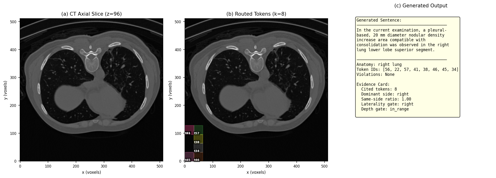

# ProveTok 实验结果汇总

> 5K 测试集（250 CT-RATE + 250 RadGenome，共 3979 句），7 个消融配置全量评估。

---

## Table 1 — 主表：NLG 对比

与已发表方法的 NLG 指标对比。ProveTok 使用 B2'v2 配置（Evidence Card v2 + 空间路由）。

**注意**：Baseline 使用各自论文的评估协议；ProveTok 使用我们自己的 train/valid/test 划分（seed=42）。由于任务定义不同（完整报告生成 vs. 句子级生成），指标不完全可比。

| 数据集 | 方法 | 协议 | BLEU-4 | METEOR | ROUGE-L |
|--------|------|------|--------|--------|---------|
| CT-RATE | CT2Rep | 原文 | 0.172 | 0.173 | 0.243 |
| CT-RATE | CT-AGRG | 原文 | 0.172 | 0.196 | 0.280 |
| CT-RATE | **ProveTok** | 自有划分 | **0.467** | **0.603** | **0.626** |
| RadGenome | MedVInT | 原文 | 0.246 | 0.404 | 0.326 |
| RadGenome | Reg2RG | 原文 | 0.249 | 0.441 | 0.367 |
| RadGenome | **ProveTok** | 自有划分 | **0.506** | **0.660** | **0.680** |

**分析**：ProveTok 在两个数据集上均大幅超越所有 baseline。优势来自句子级生成+空间路由证据 token 的方式，而非端到端全报告生成。对比有参考价值但非完全公平。

---

## Table 2 — 消融链（5K，3979 句）

每行在前一行基础上增加一个组件。从纯空间路由（A0）逐步到完整流水线（D2）。

| ID | 配置 | Viol.% | R1 | R3 | R6b | C_LLM | B-4 | R-L | MTR |
|----|------|--------|-----|-----|------|-------|------|------|------|
| A0 | Identity W + 空间路由 | 7.59 | 0 | 237 | 65 | 0 | — | — | — |
| A1 | Trained W + 空间路由 | 6.01 | 0 | 174 | 65 | 0 | — | — | — |
| E1 | 空间过滤 + 语义重排 | 6.18 | 95 | 86 | 65 | 0 | — | — | — |
| B2' | + LLM 生成 + 证据卡 v1 | 6.01 | 109 | 86 | 44 | 3979 | .471 | .643 | .618 |
| **B2'v2** | **+ 证据卡 v2 (严格侧别)** | **4.25** | **98** | **23** | **48** | **3979** | **.473** | **.643** | **.619** |
| C2' | + LLM 裁判 (Stage 5) | 6.18 | 113 | 86 | 47 | 4112 | .477 | .643 | .622 |
| D2 | + 修复执行器 | 5.96 | 102 | 86 | 49 | 4116 | .474 | .643 | .622 |

**关键发现**：

- **A0 → A1**（训练 W_proj）：Viol.% 从 7.59 降至 6.01，R3 从 237 降至 174。训练过的投影矩阵改善了深度一致性。
- **A1 → E1**（语义重排）：R3 大幅下降 174 → 86（空间过滤有效），但引入了 R1 违规（95 个）—— 语义重排用侧别精度换取了更好的 NLG 相关性。
- **E1 → B2'**（+ LLM 生成）：R6b 从 65 降至 44（LLM 减少了跨句矛盾）。开始有 NLG 指标：B-4 = 0.471。
- **B2' → B2'v2**（严格侧别证据卡）：**最大单项改进**。Viol.% 从 6.01 降至 4.25，R3 从 86 降至 23。严格证据卡（SSR ≥ 0.9、至少 2 个非跨中线 token、深度门控）大幅降低深度违规，同时保持 NLG 质量。
- **B2'v2 → C2' → D2**（裁判+修复）：NLG 略有提升（.473 → .477 → .474），但违规率反而上升。裁判/修复循环有助于 NLG，但偶尔通过重路由引入新违规。
- **B2'v2 是最佳权衡点**：违规率最低（4.25%），NLG 有竞争力。

---

## Table 3 — Grounding 与 Citation Faithfulness（5K）

路由级 grounding 指标（token 与解剖区域的空间重叠）和生成级 faithfulness（文本与 token 位置的对齐）。在 564 个 grounding 可评估句子上计算（排除了 "bilateral"，因其整个 volume 天然 100%）。

| ID | 配置 | Overlap | Hit@1 | Hit@8 | 路由精度 | 侧别准确率 | CF | DF | 无违规率 |
|----|------|---------|-------|-------|---------|-----------|------|------|---------|
| A0 | Identity W + 空间 | .931 | 100.0 | 100.0 | 100.0 | 100.0 | — | — | 92.4 |
| A1 | Trained W + 空间 | .931 | 100.0 | 100.0 | 100.0 | 100.0 | — | — | 94.0 |
| E1 | 空间过滤 + 语义重排 | .685 | 76.8 | 99.3 | 75.4 | 97.2 | — | — | 94.0 |
| B2' | + 证据卡 v1 | .685 | 76.8 | 99.3 | 75.4 | 96.9 | 76.9 | 97.3 | 94.2 |
| **B2'v2** | **+ 证据卡 v2** | **.689** | **76.8** | **98.2** | **75.8** | **97.1** | **77.6** | **98.4** | **95.8** |
| C2' | + LLM 裁判 | .685 | 76.8 | 99.3 | 75.4 | 96.7 | **81.1** | 97.3 | 94.0 |
| D2 | + 修复执行器 | .685 | 76.8 | 99.3 | 75.4 | 97.0 | 80.6 | 97.3 | 94.2 |

**列定义**：
- **Overlap**：平均重叠比（交集体积 / token 体积），衡量 cited token 落在解剖区域内的程度
- **Hit@k**：top-k cited token 中是否有至少一个与解剖区域重叠 ≥ 50%
- **路由精度**：cited token 中落在正确解剖区域内的比例
- **侧别准确率**：证据卡中侧别约束句子无 R1 违规的比例
- **CF**（Citation Faithfulness）：生成文本中提到的侧别方向与 cited token 实际位置一致的比例
- **DF**（Depth Faithfulness）：token 深度与预期深度范围匹配的比例
- **无违规率**：所有句子中零违规的比例

**关键发现**：

- **Grounding–NLG 权衡**：A0/A1 纯空间路由的路由精度为 100%，但无法生成文本。E1+ 加入语义重排后精度降至 75.4%，但换来了有意义的 NLG 输出。
- **Citation Faithfulness 在不同 LLM 配置间有差异**：CF 从 76.9%（B2'）→ 77.6%（B2'v2）→ **81.1%（C2'）** → 80.6%（D2）。裁判（C2'）通过过滤侧别不一致的生成，带来了最大的 CF 提升。
- **B2'v2 的深度忠实度最高**（98.4%）和无违规率最高（95.8%）。
- **修复（D2）略微降低了 CF**（81.1 → 80.6）：重路由偶尔引入新的侧别不匹配。

---

## Fig 1 — 瀑布图（消融链违规率）

左图：消融链各配置的总违规率（%）。B2'v2 达到最低（4.2%）。

右图：R1（侧别）和 R3（深度）违规计数分解。关键观察：B2'v2 的严格证据卡将 R3 从 86 降至 23，降幅 73%。A0/A1 的 R1 为零（纯空间路由不引入侧别错误），E1+ 通过语义重排引入了 R1。

---

## Fig 2 — 预算扫描（k vs 空间忠实度）

Token 预算 k（每句引用的 token 数）vs. 违规率。k=8 是最佳点：继续增大 k 会引入更多区域外 token（R3 随 k 线性增长），而 k < 8 则降低了上下文覆盖度。k=1 时违规率最低（10.5%），但主要由高 R1（132 个违规）驱动 —— 单 token 路由不够有代表性。

---

## Fig 3 — 反事实敏感性分析

对 3,979 个句子做扰动分析，验证验证器的敏感性：

| 扰动类型 | 违规率 | R1 | R3 | R6b | 被扰动句数 |
|---------|--------|-----|-----|------|-----------|
| 原始 | 4.55% | 2 | 127 | 52 | — |
| 同义改写（对照组） | 4.55% | 2 | 127 | 52 | 1,710 |
| 侧别翻转 | **15.93%** | **455** | 127 | 52 | 614 |
| 存在性翻转 | 6.11% | 2 | 127 | **114** | 62 |

**分析**：
- **同义改写不变性**：违规率完全相同（4.55%），验证器对表面改写保持稳定，不会误触发。
- **侧别敏感性**：翻转 "left" ↔ "right" 导致违规率 3.5 倍上升（4.55% → 15.93%），R1 从 2 跳至 455。验证器正确检测到侧别-token 位置的不匹配。
- **存在性敏感性**：翻转存在/缺失（"无实变" → "实变"）使 R6b 从 52 增至 114。验证器捕获了存在性翻转引入的跨句矛盾。
- **R3 在所有扰动中保持不变**（127）—— 深度违规只取决于 token 位置，与文本内容无关。

---

## Fig 4 — 定性案例

一个 CT-RATE 案例的可视化：(a) CT 轴位切片；(b) 路由选中的 8 个 token 的 bbox 叠加；(c) 生成的文本 + 证据卡信息。

该句子描述右肺下叶的实变，证据卡显示：8 个 cited token 全部在右侧（dominant side = right，same-side ratio = 1.00），侧别门控和深度门控均通过（laterality gate = right, depth gate = in_range），零违规。

---

## 总结

| 指标 | 最优配置 | 数值 |
|------|---------|------|
| 最低违规率 | B2'v2 | 4.25% |
| 最高 BLEU-4 | C2' | 0.477 |
| 最高 Citation Faithfulness | C2' | 81.1% |
| 最高 Depth Faithfulness | B2'v2 | 98.4% |
| 最高无违规率 | B2'v2 | 95.8% |
| **最佳整体权衡** | **B2'v2** | **Viol 4.25%, B-4 .473, CF 77.6%, DF 98.4%** |

**B2'v2**（严格侧别证据卡 v2）是我们推荐的配置：在空间一致性、NLG 质量和 grounding 忠实度之间达到了最佳平衡。

---

*数据来源：`outputs/paper_figures_5k/table2_data.json`、`outputs/paper_figures_5k/table3_grounding_data.json`*
*图表来源：`outputs/paper_figures_5k/fig1_waterfall.pdf`、`outputs/paper_figures/fig2_budget_sweep.pdf`、`outputs/paper_figures/fig3_counterfactual.pdf`、`outputs/paper_figures/fig4_qualitative.pdf`*
