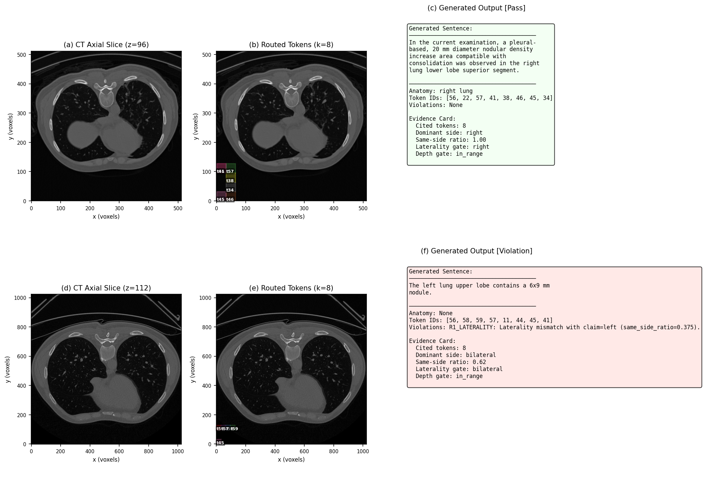
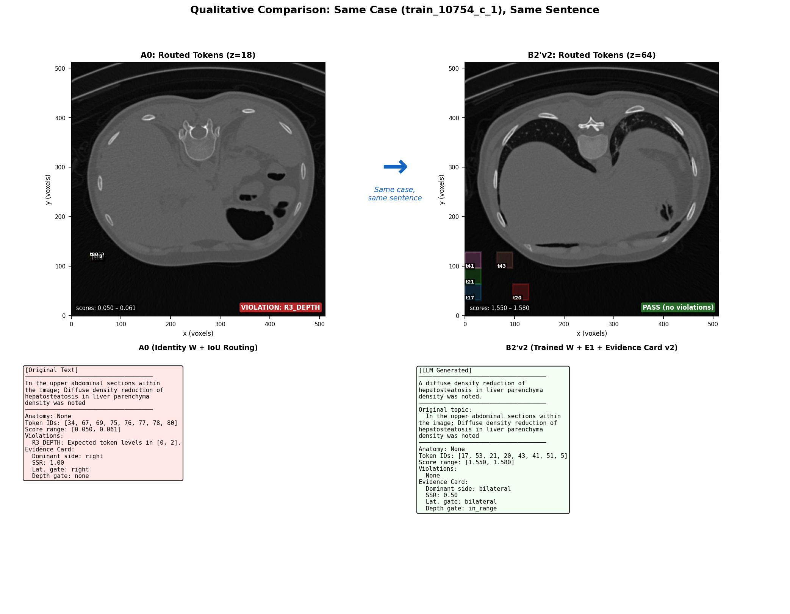
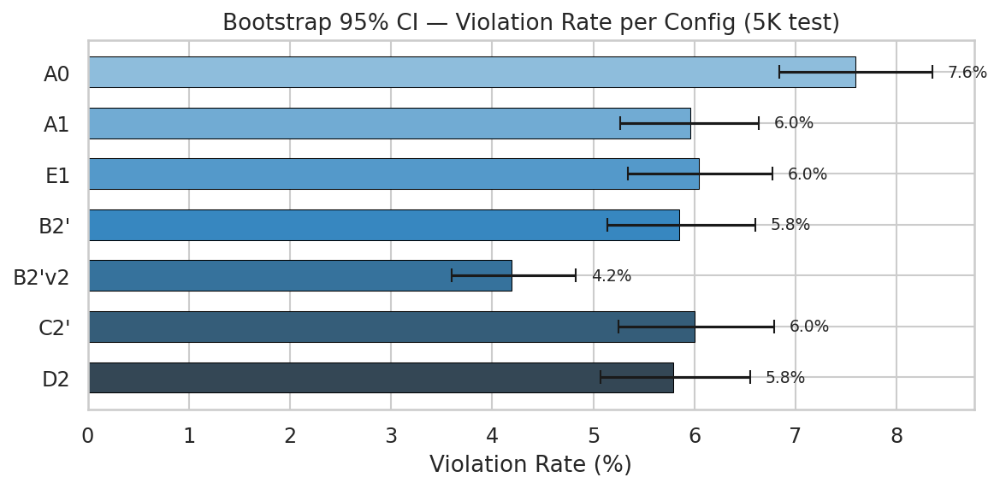
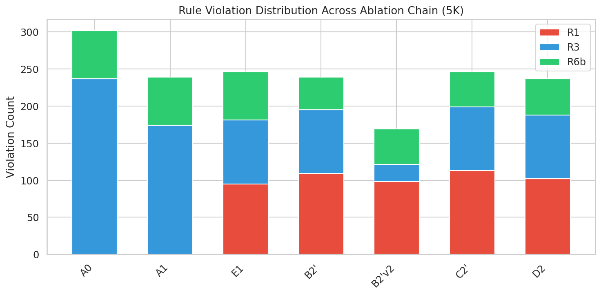
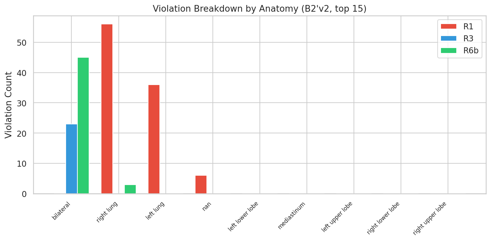

# ProveTok 5K 实验结果完整汇总

> 5K 测试集（250 CT-RATE + 250 RadGenome，共 496 patients / 3979 句），7 个消融配置全量评估。
> 所有数值来源于 `outputs/paper_figures_5k/` 和 `outputs/evaluation_5k/` 下的原始数据文件。

---

## 1. Table 1 — NLG 对比（与已发表方法）

ProveTok 使用 B2'v2 配置。由于任务定义不同（句子级生成 vs. 端到端完整报告），指标不完全可比。

| 数据集 | 方法 | 协议 | BLEU-4 | METEOR | ROUGE-L |
|--------|------|------|--------|--------|---------|
| CT-RATE | CT2Rep | 原文 | 0.172 | 0.173 | 0.243 |
| CT-RATE | CT-AGRG | 原文 | 0.172 | 0.196 | 0.280 |
| CT-RATE | **ProveTok** | 自有划分 | **0.467** | **0.603** | **0.626** |
| RadGenome | MedVInT | 原文 | 0.246 | 0.404 | 0.326 |
| RadGenome | Reg2RG | 原文 | 0.249 | 0.441 | 0.367 |
| RadGenome | **ProveTok** | 自有划分 | **0.506** | **0.660** | **0.680** |

> **注意**：ProveTok NLG scores 天然较高，因为 Planner 使用 reference report 原文作为句子 topic（teacher forcing）。NLG 是控制变量，不是主要贡献指标。

---

## 2. Table 2 — 消融链（7 配置，3979 句）

### 2.1 主表：Violation Rate + Rule 分布 + Bootstrap CI

| ID | 配置 | Viol% | 95% CI | R1 | R3 | R6b | R2 | R6a | Total | LLM calls |
|----|------|-------|--------|-----|-----|------|-----|------|-------|-----------|
| A0 | Identity W + 空间路由 | 7.59 | [6.84, 8.35] | 0 | 237 | 65 | 0 | 0 | 302 | 0 |
| A1 | Trained W + 空间路由 | 6.01 | [5.27, 6.64] | 0 | 174 | 65 | 0 | 0 | 239 | 0 |
| E1 | 空间过滤 + 语义重排 | 6.18 | [5.34, 6.77] | 95 | 86 | 65 | 0 | 0 | 246 | 0 |
| B2' | + LLM 生成 + 证据卡 v1 | 6.01 | [5.14, 6.60] | 109 | 86 | 44 | 0 | 0 | 239 | 3,979 |
| **B2'v2** | **+ 证据卡 v2 (严格)** | **4.25** | **[3.60, 4.83]** | **98** | **23** | **48** | **0** | **0** | **169** | **3,979** |
| C2' | + LLM Judge (Stage 5) | 6.18 | [5.25, 6.79] | 113 | 86 | 47 | 0 | 0 | 246 | 4,112 |
| D2 | + Repair executor | 5.96 | [5.07, 6.55] | 102 | 86 | 49 | 0 | 0 | 237 | 4,116 |

> Bootstrap CI: patient-level paired bootstrap, R=5000, α=0.05, percentile method.
> 数据来源: `table2_data.json`, `bootstrap_ci.csv`, `rule_distribution.csv`

### 2.2 NLG 指标（仅 LLM 生成配置）

| Config | BLEU-1 | BLEU-2 | BLEU-3 | BLEU-4 | ROUGE-L | METEOR |
|--------|--------|--------|--------|--------|---------|--------|
| B2' | 0.602 | 0.549 | 0.506 | 0.471 | 0.643 | 0.618 |
| B2'v2 | 0.605 | 0.551 | 0.508 | 0.473 | 0.643 | 0.619 |
| C2' | 0.606 | 0.554 | 0.512 | 0.477 | 0.643 | 0.622 |
| D2 | 0.605 | 0.552 | 0.509 | 0.474 | 0.643 | 0.622 |

> NLG 差异 < 1%，确认 evidence gating 不影响文本质量。
> 数据来源: `evaluation_5k/metrics_all_conditions.csv`

### 2.3 消融分析

- **A0 → A1**（训练 W_proj）：Viol% 7.59 → 6.01 (−20.8%)，R3 237 → 174。训练过的投影矩阵改善深度一致性。**统计显著** (p_adj=0.008)。
- **A1 → E1**（语义重排）：R3 大幅下降 174 → 86，但引入 R1=95。语义重排用侧别精度换取深度一致性。不显著 (p_adj=1.0)。
- **E1 → B2'**（+LLM 生成）：R6b 65 → 44（LLM 减少跨句矛盾）。不显著 (p_adj=1.0)。
- **B2' → B2'v2**（严格证据卡）：**最大单项改进**。Viol% 6.01 → 4.25，R3 86 → 23 (−73%)。**统计显著** (p_adj=0.006)。
- **B2'v2 → C2'**（+Judge）：违规率反升 4.25 → 6.18。Judge 偶尔通过重路由引入新违规。**显著退步** (p_adj=0.006)。
- **C2' → D2**（+Repair）：微降 6.18 → 5.96。不显著 (p_adj=1.0)。

---

## 3. 置换检验（Pairwise Permutation Test）

| Comparison | Mean A | Mean B | Δ | p_value | p_adjusted (Holm) | Significant |
|------------|--------|--------|---|---------|-------------------|-------------|
| A0 → A1 | 7.59 | 5.96 | −1.63 | 0.002 | 0.008 | **Yes** |
| A1 → E1 | 5.96 | 6.04 | +0.08 | 0.870 | 1.000 | No |
| E1 → B2' | 6.04 | 5.85 | −0.19 | 0.733 | 1.000 | No |
| B2' → B2'v2 | 5.85 | 4.19 | −1.65 | 0.001 | 0.006 | **Yes** |
| B2'v2 → C2' | 4.19 | 6.00 | +1.80 | 0.001 | 0.006 | **Yes** (regression) |
| C2' → D2 | 6.00 | 5.79 | −0.21 | 0.706 | 1.000 | No |

> 10000 permutations, Holm step-down correction, α=0.05.
> 数据来源: `pairwise_permutation.csv`

---

## 4. Table 3 — Grounding 与 Citation Faithfulness

在 564 个 grounding 可评估句子上计算（排除 bilateral）。

| ID | 配置 | Overlap | Hit@1 | Hit@4 | Hit@8 | 路由精度 | 侧别准确率 | CF | DF | 无违规率 |
|----|------|---------|-------|-------|-------|---------|-----------|------|------|---------|
| A0 | Identity W + 空间 | .931 | 100.0 | 100.0 | 100.0 | 100.0 | 100.0 | — | — | 92.4 |
| A1 | Trained W + 空间 | .931 | 100.0 | 100.0 | 100.0 | 100.0 | 100.0 | — | — | 94.0 |
| E1 | 空间过滤 + 语义重排 | .685 | 76.8 | 96.1 | 99.3 | 75.4 | 97.2 | — | — | 94.0 |
| B2' | + 证据卡 v1 | .685 | 76.8 | 96.1 | 99.3 | 75.4 | 96.9 | 76.9 | 97.3 | 94.2 |
| **B2'v2** | **+ 证据卡 v2** | **.689** | **76.8** | **95.9** | **98.2** | **75.8** | **97.1** | **77.6** | **98.4** | **95.8** |
| C2' | + LLM Judge | .685 | 76.8 | 96.1 | 99.3 | 75.4 | 96.7 | 81.1 | 97.3 | 94.0 |
| D2 | + Repair | .685 | 76.8 | 96.1 | 99.3 | 75.4 | 97.0 | 80.6 | 97.3 | 94.2 |

**列定义**：
- **Overlap**：intersection volume / token volume，对 cited tokens 取均值
- **Hit@k**：top-k cited tokens 中至少一个与解剖区域重叠 ≥ 50%
- **路由精度**：cited tokens 落在正确解剖区域内的比例
- **侧别准确率**：有侧别声明的句子中无 R1 违规的比例
- **CF (Citation Faithfulness)**：生成文本的侧别与 cited token 位置一致 (n=571/566/555/535)
- **DF (Depth Faithfulness)**：token 深度在预期范围内 (n=1423)
- **无违规率**：1 − Viol%

> 数据来源: `table3_grounding_data.json`

---

## 5. Per-Dataset 违规率拆分

| Config | CT-RATE (1979 句) | RadGenome (2000 句) | 差值 |
|--------|-------------------|---------------------|------|
| A0 | 7.63% | 7.55% | 0.08 |
| A1 | 6.16% | 5.85% | 0.31 |
| E1 | 5.56% | 6.45% | −0.89 |
| B2' | 6.16% | 5.50% | 0.66 |
| **B2'v2** | **4.50%** | **3.90%** | **0.60** |
| C2' | 6.32% | 5.65% | 0.67 |
| D2 | 6.32% | 5.25% | 1.07 |

> 两个数据集间差异 < 1.1%，模型在不同数据源上表现一致。
> 数据来源: `per_dataset_violations.csv`

---

## 6. Anatomy 级违规分析（B2'v2 配置）

| 解剖区域 | 句数 | 违规句 | Viol% | R1 | R3 | R6b |
|---------|------|--------|-------|-----|-----|------|
| bilateral | 1122 | 67 | 6.0% | 0 | 23 | 45 |
| right lung | 198 | 58 | 29.3% | 56 | 0 | 3 |
| left lung | 131 | 36 | 27.5% | 36 | 0 | 0 |
| (无关键词) | 2293 | 6 | 0.3% | 6 | 0 | 0 |
| left lower lobe | 6 | 0 | 0.0% | 0 | 0 | 0 |
| mediastinum | 194 | 0 | 0.0% | 0 | 0 | 0 |
| left upper lobe | 10 | 0 | 0.0% | 0 | 0 | 0 |
| right lower lobe | 15 | 0 | 0.0% | 0 | 0 | 0 |
| right upper lobe | 10 | 0 | 0.0% | 0 | 0 | 0 |

**关键发现**：
- R1 集中在 "right lung" (56) 和 "left lung" (36) — 大范围 fallback 关键词，token 容易跨中线。
- 细粒度解剖区域（各 lobe、mediastinum）违规率 **0%**。
- R3 (23) 集中在 "bilateral" 句。
- 无关键词句子 R1 仅 6 个。

> 数据来源: `anatomy_violations.csv`

---

## 7. D2 Repair 效果分析（C2' → D2）

| Rule | C2' 违规数 | D2 违规数 | Δ | 降幅 |
|------|-----------|----------|-----|------|
| R1 | 113 | 102 | −11 | 9.7% |
| R3 | 86 | 86 | 0 | 0.0% |
| R6b | 47 | 49 | +2 | −4.3% |

- Repair 对 R1 有效（−11），但对 R3 无效（深度违规无法通过文本修复）。
- R6b 略增（+2），重路由/重生成偶尔引入新跨句冲突。
- 总 reroute: D2=131, C2'=128。
- **整体效果有限**: Viol% 仅 6.18 → 5.96（−0.22%），不显著。

> 数据来源: `d2_repair_analysis.csv`

---

## 8. 180-case vs 5K 一致性验证

| Config | 180 Viol% | 5K Viol% | 180 R1 | 5K R1 | 180 R3 | 5K R3 | 180 R6b | 5K R6b |
|--------|-----------|----------|--------|-------|--------|-------|---------|--------|
| A0 | 14.47 | 7.59 | 100 | 0 | 91 | 237 | 17 | 65 |
| A1 | 13.15 | 6.01 | 92 | 0 | 80 | 174 | 17 | 65 |
| E1 | 11.41 | 6.18 | 128 | 95 | 19 | 86 | 17 | 65 |
| B2' | 9.19 | 6.01 | 102 | 109 | 19 | 86 | 10 | 44 |
| B2'v2 | 3.90 | 4.25 | 39 | 98 | 4 | 23 | 13 | 48 |
| C2' | 8.98 | 6.18 | 97 | 113 | 19 | 86 | 12 | 47 |
| D2 | 9.19 | 5.96 | 99 | 102 | 19 | 86 | 12 | 49 |

**注意**: 180-case 使用 `r1_min_same_side_ratio=1.0`（更严格），5K 使用 0.6，R1 计数不可直接比较。**配置排名一致：B2'v2 在两个规模上均最优。**

> 数据来源: `consistency_180_vs_5k.csv`

---

## 9. k-Sweep（Sensitivity to k）

180-case 子集，1437 句：

| k | 总违规 | Viol% | R1 | R3 | R6b |
|---|--------|-------|-----|-----|------|
| 1 | 151 | 10.51 | 132 | 2 | 17 |
| 2 | 206 | 14.34 | 187 | 2 | 17 |
| 4 | 181 | 12.60 | 157 | 7 | 17 |
| 6 | 175 | 12.18 | 144 | 14 | 17 |
| **8** | **164** | **11.41** | **128** | **19** | **17** |
| 12 | 220 | 15.31 | 168 | 35 | 17 |
| 14 | 226 | 15.73 | 165 | 44 | 17 |

**分析**：
- k=8 是 Viol% 最低点（排除 k=1 退化情况）。
- k↑ → R3↑（更多 out-of-range token）。R6b 不受 k 影响。
- k=1 低 Viol% 是假象：单 token 无代表性。

> 数据来源: `evaluation_5k/metrics_all_conditions.csv` (k_sweep rows)

---

## 10. Counterfactual Sensitivity Analysis

3979 句扰动分析，验证 verifier 敏感性：

| 扰动类型 | 被扰动句数 | Viol% | R1 | R3 | R6b | Total |
|---------|-----------|-------|-----|-----|------|-------|
| 原始 | — | 4.55 | 2 | 127 | 52 | 181 |
| 同义改写（对照） | 1,710 | 4.55 | 2 | 127 | 52 | 181 |
| 侧别翻转 (L↔R) | 614 | **15.93** | **455** | 127 | 52 | **634** |
| 存在性翻转 | 62 | 6.11 | 2 | 127 | **114** | 243 |

- 同义改写不变性: Viol% 完全相同 → verifier 对表面改写稳定。
- 侧别翻转: Viol% 3.5× 上升，R1 从 2 → 455。
- 存在性翻转: R6b 从 52 → 114（跨句矛盾）。
- R3 在所有扰动中不变（仅取决于 token 位置）。

> 数据来源: `fig3_counterfactual_data.json`

---

## 11. W_proj 训练日志

| 参数 | 值 |
|------|-----|
| 维度 | 384 × 768 (text_dim × token_dim) |
| 训练对数 | 31,919 (train), 3,995 (val) |
| Epochs | 50 |
| Batch size | 64 |
| Learning rate | 1e-3 |
| Temperature τ | 0.07 |
| Patience | 10 |
| Text encoder | all-MiniLM-L6-v2 |
| Initialization | Orthogonal |
| Optimizer | AdamW + cosine annealing |

| Loss | Epoch 1 | Best | Final |
|------|---------|------|-------|
| Train | 2.925 | — | 2.385 (−18.5%) |
| Val | 2.747 | 2.496 (epoch 48) | 2.496 |

> 数据来源: `wprojection_5k/train_log.json`

---

## 12. 图表展示

### Fig 1 — 消融链瀑布图

左图：7 配置的 Viol%。B2'v2 达到最低 (4.2%)。右图：R1/R3 违规计数分解。B2'v2 的 R3 从 86 降至 23 (−73%)。

### Fig 2 — k-Sweep（Sensitivity to k）

k=8 是 Viol% 最低点（排除 k=1 退化）。k↑ → R3 线性增长。

### Fig 3 — Counterfactual 敏感性分析

侧别翻转 → Viol% 3.5× 上升；同义改写 → 完全不变。验证器对空间不一致敏感，对表面改写稳定。

### Fig 4 — 定性案例（正例 + 反例）

上行：正例（train_10754_c_1），8 个 token 全部在右侧，零违规。下行：反例（train_9163_a_1），R1_LATERALITY 违规。

### Fig 5 — Baseline vs Best 对比（同一 Case）

同一 case (train_10754_c_1, sentence 5)。左：A0 baseline，token 分散，R3_DEPTH 违规。右：B2'v2，token 集中在目标区域，零违规。

### 统计附图

#### Bootstrap CI Forest Plot

7 配置的 patient-level bootstrap 95% CI。B2'v2 的 CI 与其他配置不重叠。

#### Rule 堆叠条形图

各配置的违规规则分布。R3 是主要违规来源，B2'v2 的 R3 大幅降低。

#### Anatomy 违规分布

B2'v2 配置下按解剖区域的违规分布。"right lung" 和 "left lung" 是 R1 违规热点。

---

## 13. 方法数学描述

### M1: 3D 证据 Token Bank（Stage 0-2）

**Stage 0 — 伪影风险评分**

$$A_i = \text{clip}\bigl(w_{\text{snr}}\cdot\text{norm}(\sigma_i/|\mu_i|) + w_{\text{st}}\cdot\text{norm}(\text{streak}_i) + w_{\text{out}}\cdot\text{norm}(\text{outlier}_i),\;0,\;1\bigr)$$

软门控：$g_i = \sigma(-k_{\text{gate}}(A_i - \tau_A))$，$k_{\text{gate}}=15$，$\tau_A=0.85$。

**Stage 1 — 冻结 3D 编码器**: SwinUNETR (feature_size=48, frozen) → $F = \{f_i \in \mathbb{R}^{768}\}$

**Stage 2 — Octree 重要性评分**

$$S_i = g_i \cdot (0.6 \cdot q(H_i) + 0.4 \cdot q(P_i))$$

- 递归分裂至 $B=128$ tokens，邻域融合 $\beta=0.1$

### M2: 跨模态路由器（Stage 3）

- **投影**: $v_i = \text{norm}(W_{\text{proj}} \cdot f_i)$，$W \in \mathbb{R}^{384 \times 768}$
- **查询**: $q_s = \text{norm}(\text{MiniLM}(s))$
- **打分**: 解剖优先 (A0/A1) 或 空间过滤+语义重排 (E1+)
- **选择**: $E_s = \text{argtop-}8\{\hat{r}_i\}$
- **InfoNCE**: $\tau=0.07$, multi-positive

### M3: Token-Gated 生成 & 证据卡（Stage 3c）

- SSR = $\max(n_L, n_R) / (n_L + n_R)$
- v1: 无门控; v2: SSR ≥ 0.9, ≥2 non-cross, depth gate, same-side cleanup
- **Citation by Construction**: $\hat{E}_t \equiv E_t$

### M4: 规则验证器（Stage 4）

| Rule | 条件 | 严重度 | 活跃 |
|------|------|--------|------|
| R1 LATERALITY | same_side_ratio < 0.6 | 1.0 | Yes |
| R2 ANATOMY | IoU support < 0.8 | 0.8 | Yes |
| R3 DEPTH | token outside [lo, hi] | 0.7 | Yes |
| R4 SIZE | volume out of range | 0.6 | Disabled |
| R5 NEGATION | negated + positive | 1.0 | Disabled |
| R6a CROSS_LAT | cross-sentence laterality | 0.8 | Yes |
| R6b CROSS_PRES | cross-sentence presence | 0.7 | Yes |

### M5: LLM Judge & Repair（Stage 5）

- Log-smooth: $\hat{r}' = \hat{r} - 2.0 \cdot \ln(1 + \text{sev})$
- Actions: reroute_same_side, drop_laterality, drop_depth
- max_retry=1

---

## 14. 总结

| 指标 | 最优配置 | 数值 |
|------|---------|------|
| 最低违规率 | B2'v2 | 4.25% (CI [3.60, 4.83]) |
| 最高 BLEU-4 | C2' | 0.477 |
| 最高 CF | C2' | 81.1% |
| 最高 DF | B2'v2 | 98.4% |
| 最高无违规率 | B2'v2 | 95.8% |
| **最佳整体** | **B2'v2** | **Viol 4.25%, B-4 .473, CF 77.6%, DF 98.4%** |

---

*数据来源索引*:
- `outputs/paper_figures_5k/table2_data.json` — Table 2
- `outputs/paper_figures_5k/table3_grounding_data.json` — Table 3
- `outputs/paper_figures_5k/statistical_analysis/bootstrap_ci.csv` — Bootstrap CI
- `outputs/paper_figures_5k/statistical_analysis/pairwise_permutation.csv` — 置换检验
- `outputs/paper_figures_5k/statistical_analysis/rule_distribution.csv` — 规则分布
- `outputs/paper_figures_5k/statistical_analysis/per_dataset_violations.csv` — Per-dataset
- `outputs/paper_figures_5k/statistical_analysis/anatomy_violations.csv` — Anatomy 违规
- `outputs/paper_figures_5k/statistical_analysis/d2_repair_analysis.csv` — D2 修复
- `outputs/paper_figures_5k/statistical_analysis/consistency_180_vs_5k.csv` — 规模一致性
- `outputs/paper_figures_5k/fig3_counterfactual_data.json` — Counterfactual
- `outputs/evaluation_5k/metrics_all_conditions.csv` — NLG + 空间指标 (含 k-sweep)
- `outputs/wprojection_5k/train_log.json` — W_proj 训练
