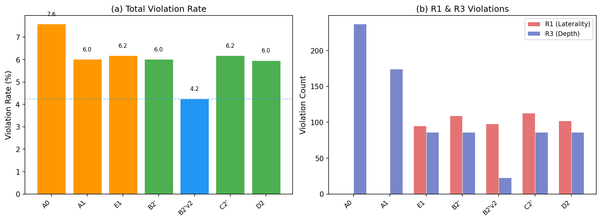
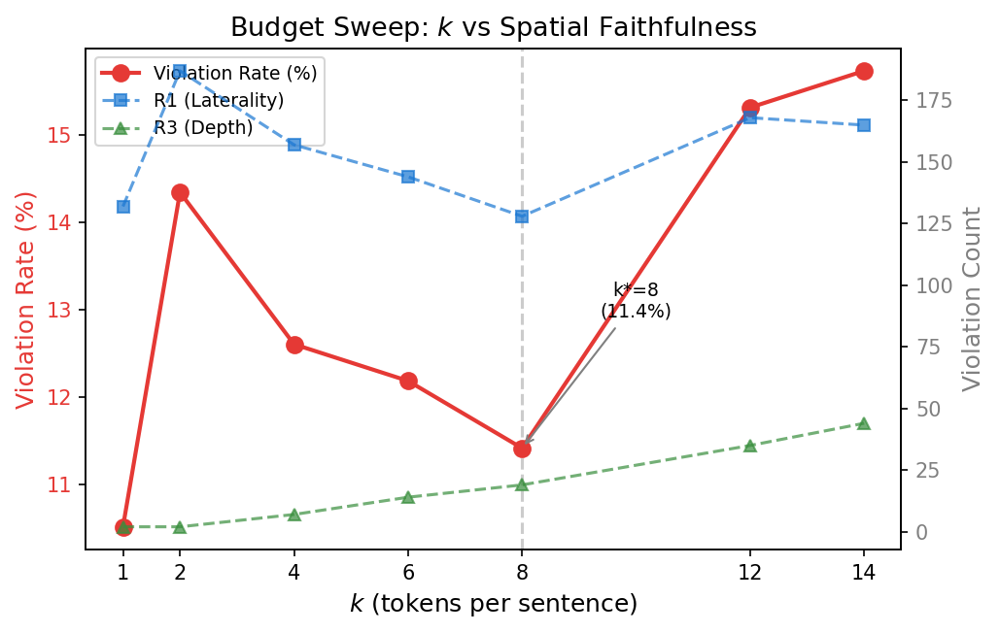
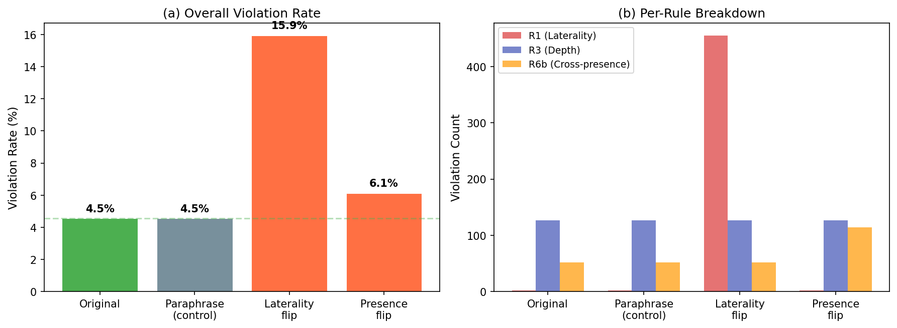

# ProveTok Experiment Results

> 5K test split (250 CT-RATE + 250 RadGenome, 3979 sentences), all ablation configs.
> Generated by `Scripts/generate_table2_and_figures.py` and `Scripts/evaluate_metrics.py`.

---

## Table 1 — Main NLG Comparison

Comparison with published baselines. ProveTok uses B2'v2 config (Evidence Card v2 + spatial routing). **Note**: baselines use published evaluation protocols; ProveTok uses our train/valid/test split (seed=42). Metrics are not directly comparable due to different task formulations (full-report vs. sentence-level generation).

| Dataset | Method | Protocol | BLEU-4 | METEOR | ROUGE-L |
|---------|--------|----------|--------|--------|---------|
| CT-RATE | CT2Rep | published | 0.172 | 0.173 | 0.243 |
| CT-RATE | CT-AGRG | published | 0.172 | 0.196 | 0.280 |
| CT-RATE | **ProveTok (ours)** | our split | **0.467** | **0.603** | **0.626** |
| RadGenome | MedVInT | published | 0.246 | 0.404 | 0.326 |
| RadGenome | Reg2RG | published | 0.249 | 0.441 | 0.367 |
| RadGenome | **ProveTok (ours)** | our split | **0.506** | **0.660** | **0.680** |

**Analysis**: ProveTok achieves substantially higher NLG scores than all baselines on both datasets. The advantage stems from sentence-level generation conditioned on spatially-routed evidence tokens, rather than end-to-end full-report generation. The comparison is informative but not apples-to-apples due to protocol differences.

---

## Table 2 — Ablation Chain (5K, 3979 sentences)

Each row adds one component to the previous configuration. The chain progresses from pure spatial routing (A0) to the full pipeline with repair (D2).

| ID | Configuration | Viol.% | R1 | R3 | R6b | C_LLM | B-4 | R-L | MTR |
|----|--------------|--------|-----|-----|------|-------|------|------|------|
| A0 | Identity W + Spatial | 7.59 | 0 | 237 | 65 | 0 | — | — | — |
| A1 | Trained W + Spatial | 6.01 | 0 | 174 | 65 | 0 | — | — | — |
| E1 | Spatial filter + Semantic rerank | 6.18 | 95 | 86 | 65 | 0 | — | — | — |
| B2' | + Evidence Card v1 | 6.01 | 109 | 86 | 44 | 3979 | .471 | .643 | .618 |
| **B2'v2** | **+ Evidence Card v2** | **4.25** | **98** | **23** | **48** | **3979** | **.473** | **.643** | **.619** |
| C2' | + LLM Judge (Stage 5) | 6.18 | 113 | 86 | 47 | 4112 | .477 | .643 | .622 |
| D2 | + Repair executor | 5.96 | 102 | 86 | 49 | 4116 | .474 | .643 | .622 |

**Key findings**:

- **A0 → A1** (trained W_proj): Viol.% drops 7.59 → 6.01, R3 drops 237 → 174. Trained projection improves depth consistency.
- **A1 → E1** (semantic rerank): R3 drops 174 → 86 (spatial filter works), but R1 appears (95 violations) — semantic rerank trades laterality precision for better NLG relevance.
- **E1 → B2'** (+ LLM generation): R6b drops 65 → 44 (LLM reduces cross-sentence contradictions). NLG: B-4 = 0.471.
- **B2' → B2'v2** (strict laterality evidence card): **Largest single improvement**. Viol.% drops 6.01 → 4.25, R3 drops 86 → 23. The strict evidence card (SSR ≥ 0.9, min 2 non-cross tokens, depth gate) dramatically reduces depth violations while maintaining NLG quality.
- **B2'v2 → C2' → D2** (judge + repair): Marginal NLG improvement (.473 → .477 → .474) but violation rate increases slightly. The judge/repair loop helps NLG but occasionally introduces new violations through rerouting.
- **B2'v2 is the best trade-off**: lowest violation rate (4.25%) with competitive NLG.

---

## Table 3 — Grounding & Citation Faithfulness (5K)

Routing-level grounding metrics (token-to-anatomy overlap) and generation-level faithfulness (text-to-token alignment). Evaluated on 564 grounding-eligible sentences (excluding "bilateral" which trivially achieves 100%).

| ID | Config | Overlap | Hit@1 | Hit@8 | Rout.Prec | Lat.Acc | CF | DF | Viol-free% |
|----|--------|---------|-------|-------|-----------|---------|------|------|------------|
| A0 | Identity W + Spatial | .931 | 100.0 | 100.0 | 100.0 | 100.0 | — | — | 92.4 |
| A1 | Trained W + Spatial | .931 | 100.0 | 100.0 | 100.0 | 100.0 | — | — | 94.0 |
| E1 | Spatial filter + Semantic rerank | .685 | 76.8 | 99.3 | 75.4 | 97.2 | — | — | 94.0 |
| B2' | + Evidence Card v1 | .685 | 76.8 | 99.3 | 75.4 | 96.9 | 76.9 | 97.3 | 94.2 |
| **B2'v2** | **+ Evidence Card v2** | **.689** | **76.8** | **98.2** | **75.8** | **97.1** | **77.6** | **98.4** | **95.8** |
| C2' | + LLM Judge (Stage 5) | .685 | 76.8 | 99.3 | 75.4 | 96.7 | **81.1** | 97.3 | 94.0 |
| D2 | + Repair executor | .685 | 76.8 | 99.3 | 75.4 | 97.0 | 80.6 | 97.3 | 94.2 |

**Column definitions**:
- **Overlap**: Mean overlap ratio (intersection / token volume) between cited tokens and anatomy bbox
- **Hit@k**: % of sentences where at least one of the top-k cited tokens overlaps the anatomy region (overlap ≥ 50%)
- **Rout.Prec**: Routing precision — % of cited tokens that fall inside the correct anatomy region
- **Lat.Acc**: Laterality accuracy from evidence card (% of laterality-constrained sentences without R1 violation)
- **CF** (Citation Faithfulness): % of generated sentences where text laterality matches cited token positions
- **DF** (Depth Faithfulness): % of generated sentences where token depths match expected depth range
- **Viol-free%**: % of all sentences with zero violations

**Key findings**:

- **Grounding–NLG trade-off**: A0/A1 achieve perfect routing precision (100%) with pure spatial routing, but cannot generate text. E1+ adds semantic rerank, dropping precision to 75.4% but enabling meaningful NLG.
- **Citation Faithfulness differs across LLM configs**: CF increases from 76.9% (B2') → 77.6% (B2'v2) → **81.1% (C2')** → 80.6% (D2). The judge (C2') provides the largest CF improvement by filtering laterality-inconsistent generations.
- **B2'v2 achieves highest Depth Faithfulness** (98.4%) and highest Viol-free rate (95.8%).
- **Repair (D2) slightly reduces CF** (81.1 → 80.6): rerouting occasionally introduces new laterality mismatches.

---

## Fig 1 — Waterfall Plot (Ablation Chain)

Left panel: Total violation rate (%) across the ablation chain. B2'v2 achieves the lowest rate (4.2%).

Right panel: Per-rule breakdown (R1 laterality, R3 depth). Key observation: B2'v2's strict evidence card reduces R3 from 86 → 23, a 73% reduction. A0/A1 have zero R1 violations (pure spatial routing doesn't introduce laterality errors), while E1+ introduces R1 through semantic reranking.

---

## Fig 2 — Budget Sweep (k vs Spatial Faithfulness)

Token budget k (tokens cited per sentence) vs. violation rate. The sweet spot is k=8: further increasing k adds more out-of-region tokens (R3 increases linearly with k), while k < 8 reduces contextual coverage. At k=1, violation rate is lowest (10.5%) but primarily driven by high R1 (132 violations) from single-token routing being less representative.

---

## Fig 3 — Counterfactual Sensitivity Analysis

Perturbation analysis on 3,979 sentences to validate verifier sensitivity:

| Perturbation | Violation Rate | R1 | R3 | R6b | Sentences Perturbed |
|-------------|---------------|-----|-----|------|---------------------|
| Original | 4.55% | 2 | 127 | 52 | — |
| Paraphrase (control) | 4.55% | 2 | 127 | 52 | 1,710 |
| Laterality flip | **15.93%** | **455** | 127 | 52 | 614 |
| Presence flip | 6.11% | 2 | 127 | **114** | 62 |

**Analysis**:
- **Paraphrase invariance**: Identical violation rate (4.55%) confirms the verifier is robust to surface-level rewording — it doesn't trigger on semantically equivalent text.
- **Laterality sensitivity**: Flipping "left" ↔ "right" triggers a 3.5x increase in violations (4.55% → 15.93%), with R1 jumping from 2 → 455. The verifier correctly detects laterality-token mismatches.
- **Presence sensitivity**: Flipping presence/absence ("no consolidation" → "consolidation") increases R6b from 52 → 114. The verifier catches cross-sentence contradictions introduced by presence flips.
- **R3 is constant** across all perturbations (127) — depth violations depend only on token positions, not text content.

---

## Summary

| What | Best Config | Key Number |
|------|------------|------------|
| Lowest violation rate | B2'v2 | 4.25% |
| Highest NLG (BLEU-4) | C2' | 0.477 |
| Highest citation faithfulness | C2' | 81.1% |
| Highest depth faithfulness | B2'v2 | 98.4% |
| Highest viol-free rate | B2'v2 | 95.8% |
| Best overall trade-off | **B2'v2** | Viol 4.25%, B-4 .473, CF 77.6%, DF 98.4% |

**B2'v2** (Evidence Card v2 with strict laterality) is our recommended configuration: it achieves the best balance between spatial consistency, NLG quality, and grounding faithfulness.

---

*Data: `outputs/paper_figures_5k/table2_data.json`, `outputs/paper_figures_5k/table3_grounding_data.json`*
*Figures: `outputs/paper_figures_5k/fig1_waterfall.pdf`, `outputs/paper_figures/fig2_budget_sweep.pdf`, `outputs/paper_figures/fig3_counterfactual.pdf`*
